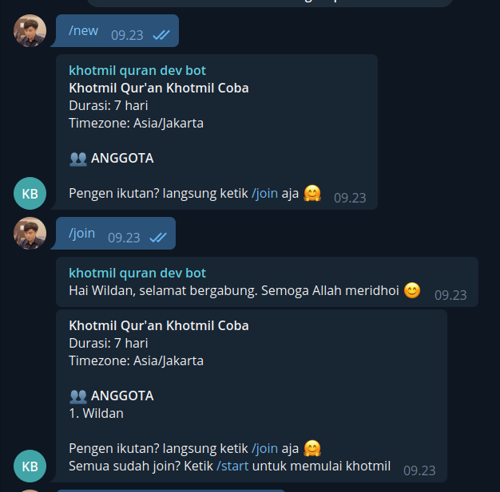
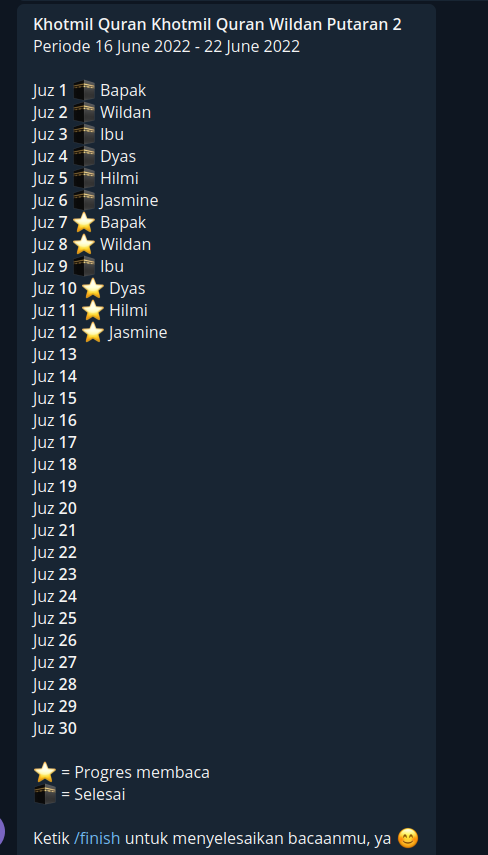
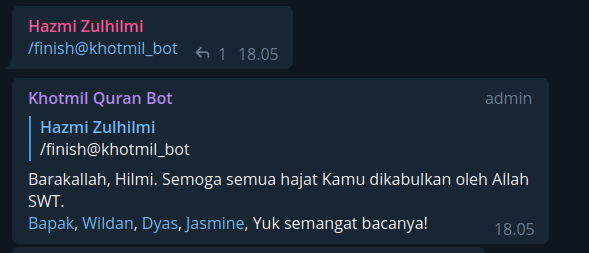
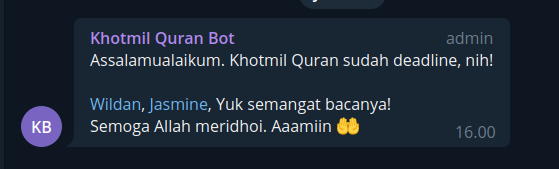

# Khotmil Bot
Khotmil bot is an Telegram Bot Application developed using Go. This bot can help you managing khotmil Quran for your family.

# Development
- Built using [go-telebot/telebot](https://github.com/go-telebot/telebot)
- MySQL database
- Redis

# Available Commands
- `/ping` - Ping this bot
- `/help` - Help command, Get a list of commands
- `/new` - New khotmil quran
- `/join` - Join khotmil Quran
- `/start` - Start khotmil quran
- `/progress` - Show khotmil progress
- `/info` - Show khotmil information
- `/finish` - Finish reading Quran
- `/reset` - Reset khotmil progress and member
- `/settimezone` - Set timezone

# Screenshots
- New and join  

- Progress  

- Finish  

- Reminder  

